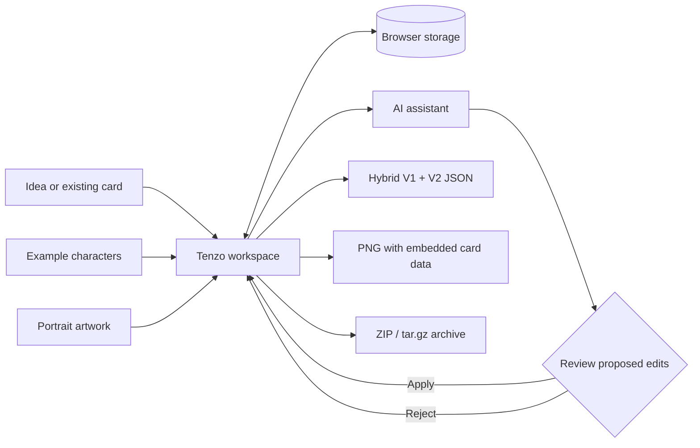
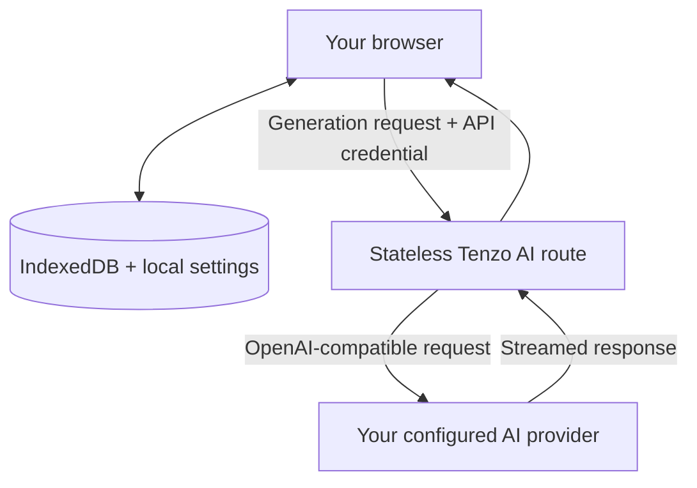

# Tenzo

> A local-first studio for designing, refining, and packaging AI character cards.

[](LICENSE)
[](.nvmrc)
[](package.json)

Tenzo turns character creation into a focused writing workflow. Build a character by hand, develop one with an AI assistant, tune each field with reusable instructions, and export a portable card for SillyTavern and other V2-compatible tools.

No account or hosted database is required. Your character library, portraits, templates, and conversations live in your browser.

## Highlights

| | Feature | What it gives you |
| --- | --- | --- |
| :sparkles: | **Character Assistant** | Explore concepts, fill gaps, and revise one field or a whole card through conversation. AI edits arrive as reviewable proposals, so you stay in control. |
| :memo: | **Purpose-built editor** | Author core identity, dialogue, alternate greetings, character books, prompt overrides, metadata, tags, and custom fields in one workspace. |
| :magic_wand: | **Field-level generation** | Generate, continue, or rewrite individual fields with streaming output, sampling controls, and token estimates. |
| :bookmark_tabs: | **Reusable templates** | Save field instructions, scope them to specific fields, and use example characters as style and structure references. |
| :framed_picture: | **Portrait studio** | Upload PNG, JPEG, WebP, or GIF artwork and adjust its focal point for a SillyTavern-ready 2:3 portrait. |
| :card_file_box: | **Local character library** | Keep multiple works in progress with automatic browser persistence and switch between them instantly. |
| :package: | **Portable import and export** | Read V1/V2 JSON and PNG cards, preserve unknown extension data, and export hybrid V1+V2 JSON or PNG cards with embedded metadata. |
| :floppy_disk: | **Bulk export and backup** | Package selected characters as ZIP or tar.gz, or back up the full workspace without including API credentials. |

## How it fits together



The assistant can focus on a single field or reason about the complete character. It streams suggestions into a separate review step; conflicting edits are detected before changes are applied to the card.

## Local-first by design



- Character data, images, assistant sessions, and templates are persisted locally.
- Card parsing, portrait processing, PNG metadata embedding, archives, and backups run in the browser.
- AI credentials are supplied per request and are never included in workspace backups or persisted by the server route.
- Tenzo works with OpenAI-compatible endpoints, including model discovery and capability checks where the provider supports them.

> [!IMPORTANT]
> Browser storage is tied to the current browser profile and origin. Export a full workspace backup before clearing site data or moving to another device.

## Under the hood

Tenzo keeps the interesting machinery close to the browser instead of hiding it behind a conventional application backend.

- **Binary assets stay binary.** Portraits are stored as `Blob` objects in IndexedDB rather than inflated base64 strings. A bounded, shared LRU cache retains object URLs for recently viewed portraits, deduplicates concurrent loads, and revokes URLs on eviction. That makes character switching feel immediate without leaking browser memory.
- **PNG cards are edited without recompressing artwork.** Tenzo reads the PNG chunk stream, removes stale `chara` or `ccv3` metadata, inserts a UTF-8/base64 `chara` `tEXt` chunk immediately before `IEND`, and reassembles the original chunks. The image data itself is never decoded and re-encoded.
- **Local data has application-level migrations.** Dexie provides stable IndexedDB stores while Tenzo tracks record migrations separately. A destructive migration must declare a warning, lock the editor, and require the user to download a recovery backup before it can run.
- **The UI writes optimistically.** Persistent collections update React immediately and roll back the local view if IndexedDB rejects the mutation, combining local-app responsiveness with durable storage semantics.
- **Assistant changes are transactions, not pasted prose.** The model produces typed patches for fields, tags, greetings, custom fields, and character books. Tenzo can detect overlapping edits and stale revisions, then lets the user apply or reject proposals explicitly.
- **Generation is streamed and cancellation-aware.** Stateless TanStack routes bridge OpenAI-compatible providers through server-sent events. Browser cancellation propagates upstream, while provider failures are normalized into actionable stream errors.
- **Backups are real archives.** Full-workspace ZIP and tar.gz files contain a versioned manifest, character records, examples, settings, and original portrait blobs. API credentials are deliberately blanked before packaging.

## Card workflow

1. Create a character or import an existing `.json` or `.png` card.
2. Write directly, generate individual fields, or collaborate with the Character Assistant.
3. Add example cards and reusable templates when you want consistent style or structure.
4. Upload and frame a portrait, then review token estimates and card metadata.
5. Export the current card, a selected collection, or a complete workspace backup.

Tenzo preserves unknown `extensions` values during import and export, including character-book and entry-level extension data. Macros such as `{{char}}` and `{{user}}` remain intact.

## Run locally

### Requirements

- [Node.js 24](https://nodejs.org/)
- [pnpm 10 or newer](https://pnpm.io/)

```bash
git clone https://github.com/CatOfJupit3r/tenzo.git
cd tenzo
pnpm install
pnpm run dev
```

Open [http://localhost:3030](http://localhost:3030), then configure an OpenAI-compatible endpoint, model, and API key in **Settings -> Connection** to enable AI features. The editor and local card tools do not require an AI connection.

## Development

Tenzo is a TypeScript monorepo centered on a React 19 application in `apps/web`, built with TanStack Start and Router, TanStack AI, Tailwind CSS 4, TipTap, Dexie, Jotai, Zod, Vitest, and Playwright.

| Command | Purpose |
| --- | --- |
| `pnpm run dev` | Start the development app |
| `pnpm run build` | Create a production build |
| `pnpm run test` | Run the test suite |
| `pnpm run check-types` | Check TypeScript types |
| `pnpm run lint` | Run ESLint |
| `pnpm run prettify` | Check formatting |

The character-card implementation lives in `apps/web/src/features/character-creator`. Product scope and implementation status are tracked in the [character card creator roadmap](docs/roadmaps/active/character-card-creator.roadmap.md).

## License

Tenzo is available under the [MIT License](LICENSE).
