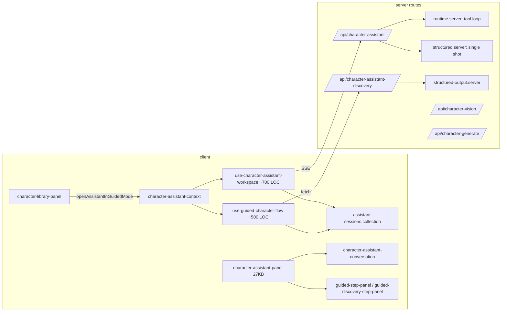

# Character Assistant Experience Overhaul

> Status: Completed
> Last repo audit: 2026-08-14
> Current summary: Complete. Character creation now uses one TanStack AI conversation with typed tool results, agentic structured-provider fallback, prompt suggestions, inline discovery and proposal review, organized domain modules, and unified TipTap content editors.

## 1. Executive Summary

Replace the guided-flow step machine with a single assistant conversation that offers **suggested next prompts** (GitHub-Copilot-style chips) derived from card completeness and conversation state. Wrap the single-shot structured-output path in a **server-side agentic loop** so providers without tool calling still produce multi-round, progressive results. Promote **discovery** ("I don't know what to build") into the main chat as a renderable card-grid message part. Restructure the assistant code into cohesive modules and finish unifying the TipTap editor stack.

All of it stands on a new foundation: the client consumes runs via TanStack `useChat` with standard AG-UI events, proposals/concepts/discovery travel as **typed tool-result parts**, both provider modes produce identical `UIMessage` parts (the structured loop synthesizes tool events), and sessions persist `UIMessage[]` through a TanStack client-persistence adapter over the existing IndexedDB collections.

## 2. Problem / Opportunity

### 2.1 Guided setup is broken and the wrong abstraction

- Entry points exist only in [character-library-panel.tsx](../../../apps/web/src/features/character-creator/components/character-library-panel.tsx) ("Start guided creation" / premise + "Discover directions"). Failures during startup discard the provisional character and close the assistant, so the feature reads as "unavailable".
- The discovery step gates progression on `isReadyForHandoff`, which is only derived inside the `CHARACTER_ASSISTANT_DISCOVERY_STATE_SCHEMA` transform ([character-assistant-contracts.ts](../../../apps/web/src/features/character-creator/lib/character-assistant-contracts.ts) ~L145-166). Any state write that bypasses `normalizeDiscoverySelection()` (collection draft mutation, persistence round-trip through `PersistentCollection`) leaves the flag stale, `canContinue` stays false in [use-guided-character-flow.ts](../../../apps/web/src/features/character-creator/hooks/use-guided-character-flow.ts) (~L143), and `finishGuidedDiscovery()` throws ([character-assistant-sessions.collection.ts](../../../apps/web/src/features/character-creator/collections/character-assistant-sessions.collection.ts) ~L204). Deriving readiness in a schema transform instead of computing it at the call site is the root design flaw.
- Structurally, the guided flow duplicates the assistant: its own step state machine (`guided.currentStep`, `completedSteps`), its own per-step instruction constants ([guided-flow.ts](../../../apps/web/src/features/character-creator/constants/guided-flow.ts), ~200 LOC of step definitions), its own panels, and a ~500 LOC god hook ([use-guided-character-flow.ts](../../../apps/web/src/features/character-creator/hooks/use-guided-character-flow.ts)) that overlaps `useCharacterAssistantWorkspace` (~700 LOC). A linear wizard is the wrong abstraction for an inherently conversational task: users cannot reorder, skip sideways, or blend steps, and every guided special case leaks into the server runtime (`/finalize-tool` marker, `isCompatibleGuidedChat` branching).

### 2.2 Structured-output mode feels non-agentic

- When the provider lacks tool calling, [character-assistant-structured.server.ts](../../../apps/web/src/features/character-creator/lib/character-assistant-structured.server.ts) issues **one** `generateValidatedObject()` call whose schema forces `assistantMessage` to max 400 chars and instructs "one sentence under 40 words". The result: a terse sentence plus a raw diff, or a sentence and *no* changes when the model puts everything into `assistantMessage`.
- There is no continuation loop, no read-then-write staging, and no way for the model to first discuss and then edit. Tool-calling mode gets `maxIterations` multi-turn behavior via TanStack AI `chat()`; structured mode gets a single shot.
- Concept/suggestion metadata (`suggestedTags`, concept object) is only captured on the concept step and silently dropped otherwise.

### 2.3 Suggestions/proposals display is limited

- `ProposalList` in [character-assistant-conversation.tsx](../../../apps/web/src/features/character-creator/components/character-assistant-conversation.tsx) renders field label + Apply/Reject only; no inline diff preview, no per-field expand, no "why" summary per patch. Full diffs render only beside the fields themselves, off-screen from the chat.
- There is no notion of *prompt suggestions* (next actions) at all — only *edit proposals*.

### 2.4 Discovery is trapped in the guided flow

- `generateCharacterAssistantDiscoveryDirections()` ([character-assistant-discovery-client.ts](../../../apps/web/src/features/character-creator/lib/character-assistant-discovery-client.ts)) is only invoked from the guided discovery step and requires a user-authored premise. A user who "doesn't know what character to create" has no zero-input path, and discovery results cannot appear inside a normal chat conversation.

### 2.5 Code organization debt

- Two proposal-creation paths (tool `.server()` handlers vs. manual `store.appendProposedCard()` after structured runs), two concept-recording paths, and instruction-building split across [character-assistant-runtime.server.ts](../../../apps/web/src/features/character-creator/lib/character-assistant-runtime.server.ts) and [character-assistant-structured.server.ts](../../../apps/web/src/features/character-creator/lib/character-assistant-structured.server.ts) with diverging extras.
- A hand-rolled conversation protocol: a custom SSE event vocabulary in [character-assistant-stream.ts](../../../apps/web/src/features/character-creator/lib/character-assistant-stream.ts), a custom `{ role, content }` session message schema, and manual runtime-vs-session state merging in [use-character-assistant-workspace.ts](../../../apps/web/src/features/character-creator/hooks/use-character-assistant-workspace.ts) — all duplicating what TanStack AI's `ChatClient`/`useChat` already provides (AG-UI events, `UIMessage[]`, run lifecycle, cancellation, transport).
- `lib/` holds 60+ files spanning six unrelated concerns (assistant, cards/IO, editor, prompt pipeline, provider, portrait) in one flat-ish namespace.
- The TanStack AI migration (branch `migrate-to-tanstack-ai`) is largely complete server-side; this roadmap builds on it and must not reintroduce non-TanStack generation paths.

### 2.6 TipTap unification gaps

Remaining plain `<Textarea>` surfaces that hold character/prompt content, plus duplicated editor plumbing (see Section 8).

## 3. Goals

1. One assistant experience: guided setup becomes **suggested next prompts** inside the main chat; the step wizard, its panels, and its state machine are deleted.
2. Structured-output providers get an **agentic loop**: plan → converse → propose across multiple bounded rounds, with streaming text and incremental proposals, UX-equivalent to tool-calling mode.
3. Richer in-chat proposal display: inline compact diffs, per-patch apply/reject, expandable details.
4. **Discovery as a chat capability**: reachable with zero input ("surprise me") or a premise, rendered as selectable direction cards inline in conversation, feeding selections back as context.
5. Assistant code reorganized into cohesive modules with single proposal/concept/instruction pipelines.
6. All multi-line character/prompt content surfaces use the unified TipTap stack; editor plumbing deduplicated.
7. **Standard chat protocol**: the client consumes runs via TanStack `useChat`; proposals, concepts, and discovery are typed tool-result parts; sessions persist `UIMessage[]`; no custom SSE vocabulary or parallel message abstraction remains.

## 4. Non-Goals

- No new AI SDKs — TanStack AI only (`@tanstack/ai`, `@tanstack/ai-openai`, `@tanstack/ai-openrouter`).
- No preservation of the guided-flow session shape or migration of in-flight guided sessions (full rewrite opportunity, no back-compat debt).
- No server-side conversation persistence; sessions stay in IndexedDB collections. TanStack *client* persistence (browser transcript storage through those same collections) is in scope and is not server persistence.
- No revise-sessions or prompt-presets work (deferred phases of the card-creator roadmap).
- No automatic provider capability probing beyond the existing error-based fallback (may be a later roadmap).
- No Code Mode (requires native tool calling; obscures reviewable mutation boundaries), lazy tools (guided/focus filtering keeps the active catalog small), interrupts (proposals already have a post-generation review workflow; reserve interrupts for destructive or externally visible actions), client tools (jump-to-field/selection are ordinary UI actions, not model-controlled), provider-native tools (undermine arbitrary-endpoint portability), MCP (no external-system requirement), media/realtime features, or provider reasoning display (explicit application progress is more useful and portable).
- No OpenTelemetry export until there is an explicit privacy and observability policy; only the bounded safety middleware ships.
- Resumable streams are a deferred follow-up (Section 7.8), not part of the initial phases.

## 5. Current State (verified 2026-08-14)

### Architecture



### Key facts

- Modes: `CHARACTER_ASSISTANT_GENERATION_MODES` = `structured-output` (default) | `tool-call`, user-selected in connection settings; error-based fallback via `shouldFallbackFromToolCalling()`.
- Tools: `read_character`, `record_concept`, `propose_character_fields`, `propose_tags`, `propose_alternate_greetings`, `propose_custom_fields`, `propose_character_book` ([character-assistant-tools.ts](../../../apps/web/src/features/character-creator/lib/character-assistant-tools.ts)).
- SSE events: `text-delta`, `tool-call-start`, `concept-recorded`, `proposal`, `tool-call-error`, `complete`, `error` ([character-assistant-stream.ts](../../../apps/web/src/features/character-creator/lib/character-assistant-stream.ts)).
- Guided steps: concept → appearance → personality → scenario → voice → metadata → review, defined in [guided-flow.ts](../../../apps/web/src/features/character-creator/constants/guided-flow.ts).
- Discovery: 4 categories (character-concept, relationship-dynamic, scenario, tone), 3 cards each, generated in 4 parallel client fetches with 45s timeouts from the god hook.

## 6. Design Principles

- **Conversation is the spine.** Everything (discovery cards, proposals, suggestions) is a message part rendered inline; no parallel state machines beside the chat.
- **Suggestions are data, not modes.** A suggested next prompt is a plain string the user can tap to send; the server never needs to know a suggestion was used.
- **One proposal pipeline.** Tool results and structured-loop results converge into the same `iCharacterEditProposal` creation path before being emitted as tool-result parts.
- **Derived state is computed, never stored.** Readiness/completeness flags (`isReadyForHandoff`-style) are pure functions of state at the call site, never persisted fields, never schema-transform side effects.
- **TanStack owns the protocol; the app owns the domain.** `UIMessage[]`, part assembly, streaming/loading/error state, cancellation, `threadId`/`runId`, and transport belong to `ChatClient`/`useChat`. Character cards, proposal status/conflicts, apply/reject operations, composer drafts, attachments, editor focus/navigation, and deterministic suggestions stay application state.
- **Message parts are historical events; collections are current state.** A proposal's tool-result part records what the model produced; the proposal collection is the authoritative, mutable status (applied/rejected/conflict).
- **Modes differ in orchestration, not protocol.** Tool-calling and the structured loop both emit standard AG-UI events and produce identical `UIMessage` parts — the loop synthesizes `TOOL_CALL_*` events for its actions.

## 7. Target Architecture

### 7.1 TanStack chat protocol and client (foundation)

Adopt `@tanstack/ai-react` (`useChat`/`ChatClient`) and the standard AG-UI event protocol as the conversation backbone. Ownership split:

| TanStack owns | App owns |
| --- | --- |
| `UIMessage[]`, text + structured-output assembly | Character cards |
| Tool-call and tool-result parts | Proposal status, conflicts, apply/reject operations |
| Streaming/loading/error state, cancellation | Composer drafts, attachments |
| `threadId`/`runId`, transport, reconnection | Editor focus/navigation |
| Interrupts (unused for now) | Deterministic next-prompt suggestions |

**Concept mapping** — no custom message-part types are needed; typed tool results are the extensibility boundary:

| Roadmap concept | TanStack representation |
| --- | --- |
| Assistant prose | `TextPart` |
| Proposal action | `ToolCallPart` |
| Generated proposal | `ToolResultPart.output` containing the full `iCharacterEditProposal` |
| Concept recording | `record_concept` tool result |
| Discovery cards | `suggest_character_directions` tool result |
| Final response + follow-up suggestions | `StructuredOutputPart<iAssistantFinalResponse>` |
| Tool progress/error | Tool part state |
| Run completion / failure | `RUN_FINISHED` / `RUN_ERROR` |
| Model reasoning (if ever shown) | `ThinkingPart` |

Tools return their full typed domain payloads:

```typescript
const PROPOSAL_TOOL_RESULT_SCHEMA = z.object({
  proposal: CHARACTER_EDIT_PROPOSAL_SCHEMA,
});

const proposeTags = toolDefinition({
  name: CHARACTER_ASSISTANT_TOOL_NAMES.propose_tags,
  inputSchema: PROPOSE_TAGS_INPUT_SCHEMA,
  outputSchema: PROPOSAL_TOOL_RESULT_SCHEMA,
}).server(async (input, context) => ({
  proposal: createProposalFromChanges({ toolCallId: context?.toolCallId, input }),
}));
```

The conversation renderer becomes a **tool-part renderer registry** keyed by tool name (proposal UI, concept chip, discovery grid). Proposal status stays domain-owned: the message part is the proposal's original event; the proposal collection is its current authoritative state.

**The custom SSE protocol is deleted.** Most of [character-assistant-stream.ts](../../../apps/web/src/features/character-creator/lib/character-assistant-stream.ts) and the manual runtime-state merging in `useCharacterAssistantWorkspace` go away:

| Existing event | Standard replacement |
| --- | --- |
| `text-delta` | `TEXT_MESSAGE_*` |
| `tool-call-start` | `TOOL_CALL_START` |
| `tool-call-error` | Tool result error state |
| `proposal` | Proposal tool result |
| `concept-recorded` | Concept tool result |
| `complete` | `structured-output.complete` + `RUN_FINISHED` |
| `error` | `RUN_ERROR` |
| `discovery-cards` (was planned) | Discovery tool result |
| `follow-up-suggestions` (was planned) | Final structured output |

Custom events remain allowed only for ephemeral progress (e.g. "Generating category 2 of 4"), never as a persistence format.

**Shared final response schema** — both provider paths converge on one final structured output:

```typescript
const ASSISTANT_FINAL_RESPONSE_SCHEMA = z.object({
  assistantMessage: z.string(),
  followUpSuggestions: z.array(z.string()).max(3),
});
```

Tool-capable providers use TanStack's combined tools + structured-output lifecycle directly (tool parts first, final structured-output part last):

```typescript
const stream = chat({
  adapter,
  messages,
  tools,
  outputSchema: ASSISTANT_FINAL_RESPONSE_SCHEMA,
  agentLoopStrategy: maxIterations(8),
  stream: true,
});
```

The server route emits via `toServerSentEventsResponse`; the client consumes via `useChat` + `fetchServerSentEvents`.

**Persistence:** sessions store TanStack `UIMessage[]` alongside proposal records through a client-persistence adapter (`getItem`/`setItem`/`removeItem` per `threadId`) wrapping the existing IndexedDB session collection. The custom `{ role, content }` message schema is deleted. The v4 storage-key bump is the migration boundary; v3 transcripts are dropped with no conversion. This is browser transcript persistence, not server persistence.

**Safety middleware (selective):** max tool calls per run, max parallel tool calls per turn, usage aggregation, abort propagation, optional schema normalization, redacted development-only logging. `maxIterations()` only bounds model turns — it does not prevent one turn from requesting many parallel tools.

**Devtools:** TanStack AI devtools ship development-only together with this migration — inspect native vs. synthetic tool calls, verify both provider modes produce identical parts, inspect run IDs and round boundaries, replay proposal/discovery fixtures.

### 7.2 Suggested next prompts (replaces guided flow)

**New module** `lib/assistant/next-prompt-suggestions.ts`:

- `deriveNextPromptSuggestions({ card, session, lastAssistantMessage }): iNextPromptSuggestion[]`
- `iNextPromptSuggestion = { id, label, prompt, kind }` with `kind` from a `z.enum(['discover', 'fill-field', 'refine', 'review', 'image'])`-backed schema.
- Two suggestion sources, merged and capped (max 4):
  1. **Deterministic (client, always available):** card-completeness heuristics reusing the old step ordering as *priority hints*, e.g. empty `description` → "Describe {{char}}'s appearance and presence"; empty `personality` → "Define personality, quirks, and flaws"; no `first_mes` → "Draft an opening scene"; card mostly full → "Review the card for contradictions". This is where the seven guided step definitions' `userPrompt`/`agentInstructions` content is salvaged — as suggestion templates, not as a state machine.
  2. **Model-provided (optional):** read from the final `StructuredOutputPart` of the last assistant message (`ASSISTANT_FINAL_RESPONSE_SCHEMA.followUpSuggestions`, max 3), identical in both provider modes. No dedicated tool and no custom event; older turns naturally retain the suggestions generated for them.

  ```typescript
  const suggestions = mergeNextPromptSuggestions({
    deterministic: deriveNextPromptSuggestions({ card, messages }),
    modelProvided: lastStructuredPart?.data.followUpSuggestions ?? [],
    maximum: 4,
  });
  ```
- **UI:** chip row above the composer in [character-assistant-panel.tsx](../../../apps/web/src/features/character-creator/components/character-assistant-panel.tsx); clicking a chip fills-and-sends. Empty new-character session shows the "cold start" set: "Help me discover a character", "I have a premise: ...", "Start from an image".
- **Deletions:** `use-guided-character-flow.ts` (+test), `guided-flow/` panels except discovery card grid (repurposed, see 7.4), `constants/guided-flow.ts` step machine, `guided` branch of the session schema, `/finalize-tool` marker, `isCompatibleGuidedChat` branching, `startGuidedSession`/`advanceGuidedStep`/`finishGuidedDiscovery` collection functions. (The `:v4` storage-key bump and transcript reset happen in Phase 0, see 7.1.)

### 7.3 Agentic structured-output loop

**Rewrite** [character-assistant-structured.server.ts](../../../apps/web/src/features/character-creator/lib/character-assistant-structured.server.ts) as a bounded server-side loop (`MAX_STRUCTURED_ROUNDS = 4`):

- Each round the model returns a structured object:
  ```
  {
    assistantMessage: string,        // no 40-word cap; conversational
    actions: [                       // 0..n, mirrors tool names
      { action: 'propose_character_fields', changes, summary } | 
      { action: 'propose_tags', ... } | ...
    ],
    isDone: boolean                  // model signals loop end
  }
  ```
- The server translates each `action` into **synthetic standard tool events** through the same handlers the native tools use:

  ```
  structured action
      -> synthetic TOOL_CALL_START
      -> shared action handler (createProposalFromChanges / recordConcept / generateDirections)
      -> synthetic TOOL_CALL_END + TOOL_CALL_RESULT
      -> next structured round
  ```

  `assistantMessage` streams as standard text events; a compact summary of executed actions feeds the next round's context. Loop ends on `isDone`, empty `actions`, or round cap. On completion the loop emits the final `ASSISTANT_FINAL_RESPONSE_SCHEMA` structured-output part (7.1) — from `ChatClient`'s perspective, both provider modes produce identical `UIMessage` parts.
- Guarantees that fix today's failure modes: a reply with prose-only round 1 still proceeds to an edit round; a diff is always accompanied by explanation; "1 sentence then nothing" cannot happen because empty-action + `isDone:false` triggers a continuation nudge round.
- `generateValidatedObject()` in [structured-output.server.ts](../../../apps/web/src/features/character-creator/lib/structured-output.server.ts) stays the transport primitive.
- Delete the finalize-marker fallback in [character-assistant-provider-errors.ts](../../../apps/web/src/features/character-creator/lib/character-assistant-provider-errors.ts); keep only the "unsupported tool use" error fallback, which now falls back to the loop (identical message parts, so the client does not care).

### 7.4 Discovery in main chat

- New assistant tool `suggest_character_directions` (tool mode) and equivalent `actions` entry (structured loop): input `{ premise?: string }`, output = existing 4-category card payload. Server reuses the direction-generation logic behind [/api/character-assistant-discovery](../../../apps/web/src/routes/api/character-assistant-discovery.ts); premise becomes optional — when absent, the model invents varied premises itself (this is the "I don't know what to create" path).
- No bespoke event, persistence, or hydration format: the discovery tool result **is already a persistent message part**. The renderer registry branches on the tool name:

  ```typescript
  if (
    part.type === 'tool-call' &&
    part.name === CHARACTER_ASSISTANT_TOOL_NAMES.suggest_character_directions &&
    part.output
  ) {
    return <DiscoveryCardGrid cards={part.output.cards} />;
  }
  ```
- **UI:** repurpose the card grid from [guided-discovery-step-panel.tsx](../../../apps/web/src/features/character-creator/components/guided-flow/guided-discovery-step-panel.tsx) into `components/assistant/discovery-card-grid.tsx`, rendered inline in the conversation. Selecting cards + "Use these directions" sends a synthesized user message summarizing selections (plain text — the existing `buildDeterministicDiscoveryHandoffSummary()` logic becomes a message formatter). No `isReadyForHandoff`; the button is enabled iff `selectedCardIds.length > 0`, computed in the component.
- Cold-start suggestion chip "Help me discover a character" sends a prompt the model answers by invoking the directions tool/action.

### 7.5 Richer proposal display in chat

Upgrade `ProposalList` in [character-assistant-conversation.tsx](../../../apps/web/src/features/character-creator/components/character-assistant-conversation.tsx):

- Per-patch collapsible row: field label, status badge, and a compact inline diff (reuse [rewrite-diff.ts](../../../apps/web/src/features/character-creator/lib/editor/rewrite-diff.ts) + a slimmed [rewrite-diff-review.tsx](../../../apps/web/src/features/character-creator/components/editor/rewrite-diff-review.tsx) presentation).
- Keep Apply/Reject per patch + Apply-all/Reject-all; add "jump to field" affordance.
- Show proposal summary always; show per-patch model reasoning when present.

### 7.6 Module reorganization (`lib/` split)

Move files into intent-scoped folders (no `index.ts` barrels, direct imports only):

| Target folder | Contents (moved from `lib/`) |
| --- | --- |
| `lib/assistant/` | character-assistant-contracts, -session, -session-storage, -tools, -runtime.server, -structured.server (rewritten as -loop.server), -provider-errors, -generation-mode, next-prompt-suggestions (new), message-persistence (new TanStack persistence adapter), discovery-directions (merged -discovery-client + -discovery-state remnants); character-assistant-stream.ts is deleted in Phase 0 |
| `lib/proposals/` | character-edit-proposal + new shared proposal factory extracted from tools/structured paths |
| `lib/cards/` | card-schema, card-format, card-files, png-embed, archive, backup, character-library, character-library-storage, example-characters, image-store, image-utils |
| `lib/generation/` | tanstack-ai-text-generation, structured-output.server, generation-config, generation-stream-contracts, response-parser, token-stats, strict-template-renderer |
| `lib/provider/` | provider-health, provider-health-proxy, openai-compatible-endpoint |
| `lib/portrait/` | portrait-asset-cache, portrait-focal-point |
| `lib/vision/` | character-vision-client, character-vision-contracts, character-vision.server |
| `lib/editor/`, `lib/prompt/` | unchanged (already cohesive) |

Pipeline unifications (do during the move, not after):

- [x] Single `createProposalFromChanges()` used by every tool `.server()` handler and every structured-loop action.
- [x] Single `recordConcept()` path.
- [x] Single `buildAssistantSystemPrompt({ mode })` producing both variants from shared blocks; mode-specific text lives in one file.
- [x] Split what remains of `use-character-assistant-workspace.ts` after Phase 0 (TanStack owns the run lifecycle and message state): extract `use-proposal-actions.ts` (apply/reject/conflicts) from the domain/session state hook.

### 7.7 Suggested UX flow after overhaul

1. New character → assistant opens with cold-start chips (discover / premise / image).
2. "Help me discover a character" → model emits discovery card grid → user selects 2 cards → "Use these directions" → model records concept + proposes name/description → chips update to "Define personality", "Draft an opening scene".
3. User taps chips or types freely; every model turn ends with proposals inline (compact diffs) and fresh follow-up chips.
4. Works identically on a no-tool-support provider via the structured loop.

### 7.8 Deferred follow-up: resumable streams

Multi-round loops and parallel discovery generation make runs long enough that reconnection has real value, but it depends on standardizing the transport first, so it lands after the overhaul phases:

1. `threadId` and `runId` on every run (already present from 7.1).
2. Attach `memoryStream()` initially.
3. Add the GET resume handler.
4. Consider an external durability backend only if deployment topology requires it.

This is delivery durability, not server conversation persistence, so it does not conflict with the local-first decision.

## 8. TipTap Unification Audit (Goal 6 work list)

Surfaces **not** on the unified stack that should be:

| Surface | File | Current | Action |
| --- | --- | --- | --- |
| AI instructions | [field-generation-controls.tsx](../../../apps/web/src/features/character-creator/components/field-generation-controls.tsx) (~L153) | plain `Textarea` | → `MarkdownFieldEditor` (macro highlighting matters here) |
| Template content (save dialog) | [save-template-dialog.tsx](../../../apps/web/src/features/character-creator/components/save-template-dialog.tsx) (~L109) | plain `Textarea` | → `MarkdownFieldEditor` (templates panel already uses it — same content, two editors today) |
| Custom discovery direction description | [guided-discovery-step-panel.tsx](../../../apps/web/src/features/character-creator/components/guided-flow/guided-discovery-step-panel.tsx) (~L294) | plain `Textarea` | → `MarkdownFieldEditor` when repurposed into `discovery-card-grid.tsx` |
| Discovery premise | [character-library-panel.tsx](../../../apps/web/src/features/character-creator/components/character-library-panel.tsx) (~L364) | plain `Textarea` | absorbed into chat composer (`ChatInputEditor`) by 7.4 |

Acceptable plain inputs (single-line identifiers, not content): name, creator, character_version, book name, entry keys, insertion order, template names.

Editor plumbing duplication to consolidate:

- [x] `use-markdown-field-editor.ts` and `use-mes-example-editor.ts` are identical wrappers over `use-synced-field-editor.ts`; fold into a `createSyncedEditorHook(buildExtensions, serialize, toContent)` factory in `lib/editor/`.
- [x] `ChatInputEditor` builds extensions inline with raw `useEditor` instead of the synced hook; align it with the factory (keeping its mention/submit specifics).
- [x] Placeholder + MacroHighlight setup duplicated between [markdown-editor-extensions.ts](../../../apps/web/src/features/character-creator/lib/editor/markdown-editor-extensions.ts) and [mes-example-extensions.ts](../../../apps/web/src/features/character-creator/lib/editor/mes-example-extensions.ts); extract shared `buildBaseEditorExtensions(config)`.
- [x] Three parallel serializers (`serializeEditorMarkdown`, `serializeMesExampleDoc`, `serializeChatInput`) — keep separate behavior, but define one `iEditorSerializer` interface and colocate them.
- [x] Editor accessibility attributes (`role`, `aria-multiline`, `aria-label`) built independently in all three components; extract `buildEditorAccessibilityAttributes()`.

## 9. Implementation Plan

### Phase 0 — TanStack chat protocol and client (foundation)

- [x] Add `@tanstack/ai-react`.
- [x] Define `ASSISTANT_FINAL_RESPONSE_SCHEMA` (shared final response for both provider modes).
- [x] Make proposal, concept, and discovery tools return their full typed domain payloads (`outputSchema` = domain schema, e.g. `{ proposal: CHARACTER_EDIT_PROPOSAL_SCHEMA }`).
- [x] Convert `/api/character-assistant` to standard AG-UI events via `toServerSentEventsResponse`.
- [x] Replace the custom stream consumer with `useChat` + `fetchServerSentEvents`; delete `character-assistant-stream.ts` and the runtime-state merging in the workspace hook.
- [x] Client-persistence adapter storing `UIMessage[]` through the sessions collection; bump storage key to v4 (v3 transcripts dropped, no conversion).
- [x] Tool-part renderer registry for proposal/concept results in the conversation.
- [x] TanStack AI devtools, development-only.
- [x] Tests: `UIMessage` part fixtures, persistence adapter round-trip, renderer registry dispatch.

### Phase 1 — Agentic structured loop (server)

- [x] Rewrite structured single-shot into the bounded multi-round loop (7.3), translating actions into synthetic `TOOL_CALL_START`/`TOOL_CALL_END`/`TOOL_CALL_RESULT` events through shared action handlers.
- [x] Extract shared `createProposalFromChanges()` + single `recordConcept()` path; route native tools and loop actions through them.
- [x] Remove the 40-word `assistantMessage` cap and finalize-marker machinery.
- [x] Emit the final `ASSISTANT_FINAL_RESPONSE_SCHEMA` structured-output part (carries `followUpSuggestions`) in both modes.
- [x] Bounded safety middleware: max tool calls per run, max parallel calls per turn, usage aggregation, abort propagation.
- [x] Tests: loop continuation on empty-action rounds, round cap, `UIMessage` part parity with tool mode, fallback from unsupported tool use into loop.

### Phase 2 — Suggested next prompts (client)

- [x] `lib/assistant/next-prompt-suggestions.ts` with deterministic heuristics derived from guided step content; merge model suggestions read from the last final `StructuredOutputPart`.
- [x] Chip row UI in assistant panel; cold-start set for empty sessions.
- [x] Tests: heuristic priorities per card completeness, merge/cap behavior.

### Phase 3 — Discovery in chat

- [x] `suggest_character_directions` tool + structured-loop action, optional premise, reusing discovery generation server logic.
- [x] Register the discovery tool result in the renderer registry (the tool result is already a persistent message part; no bespoke event or persistence format).
- [x] `discovery-card-grid.tsx` inline renderer (selection state local; handoff = formatted user message). Delete `isReadyForHandoff` everywhere.
- [x] Tests: zero-premise generation request shape, selection → message formatting, grid rendering with selections.

### Phase 4 — Delete guided flow

- [x] Remove guided hook, step panels, step constants, session `guided` branch, guided collection functions, guided branches in panel/conversation/runtime (storage key already bumped in Phase 0).
- [x] Library panel: replace guided/discovery entry points with "Create with assistant" (opens chat with cold-start chips).
- [x] Update/remove affected tests.

### Phase 5 — Proposal display upgrade

- [x] Inline compact diffs per patch in `ProposalList` (reuse rewrite-diff), collapsible details, jump-to-field.
- [x] Tests: apply/reject flows from chat, diff rendering for text/list/book patches.

### Phase 6 — Module reorganization

- [x] Execute the `lib/` split per 7.6 (mechanical moves + import updates; no behavior change).
- [x] Split the post-Phase-0 remainder of `use-character-assistant-workspace.ts` into proposal-actions and domain/session hooks (run lifecycle belongs to TanStack).

### Phase 7 — TipTap unification

- [x] Convert the three remaining content textareas (Section 8) to `MarkdownFieldEditor`.
- [x] Editor factory + shared extension/accessibility consolidation.
- [x] Tests: round-trip serialization unchanged for converted surfaces.

### Deferred follow-up — resumable streams

- [ ] After all phases: `memoryStream()` + GET resume handler per 7.8; external durability backend only if deployment topology requires it.

Each phase must leave `pnpm run check-types`, `pnpm run lint`, and `pnpm run test` green.

### Completion verification — 2026-08-14

- `pnpm run check-types` — passed.
- `pnpm run lint` — passed.
- `pnpm run test` — passed: 44 files, 175 tests.
- `pnpm run build` — passed for client and SSR production bundles; development-only AI devtools were removed from both outputs.
- Acceptance greps found no guided-step/finalize-marker identifiers, production character-content textareas, or flat files directly under `lib/`.
- The resumable-stream item remains explicitly deferred by Section 7.8 and is not part of this completed overhaul.

## 10. Acceptance Criteria

1. No `guided` mode, step IDs, or step panels remain in the codebase; grep for `guidedStep|GUIDED_STEP|isReadyForHandoff|finalize-tool` returns nothing outside this roadmap.
2. With a provider that rejects tool calls, a request like "make me a cyberpunk librarian" yields: conversational streamed text, at least one proposal with inline diff, and follow-up chips — across multiple loop rounds when needed.
3. An empty session shows cold-start chips; "Help me discover a character" with no premise produces a selectable card grid inline in chat; using selections leads to concept + field proposals.
4. Proposal rows in chat show compact diffs and per-patch apply/reject.
5. The client consumes assistant runs exclusively through `useChat`; `character-assistant-stream.ts` and the custom `{ role, content }` session message schema no longer exist; sessions persist `UIMessage[]` through the persistence adapter.
6. Both provider modes produce identical `UIMessage` part sequences for the same logical run (fixture-verified).
7. `lib/` files live in the folders of Section 7.6 with direct imports (no barrels, no re-exports).
8. AI instructions, save-template content, and discovery card descriptions use the TipTap markdown editor.

## 11. Risks

| Risk | Mitigation |
| --- | --- |
| Structured loop multiplies token cost | Round cap (4), compact action summaries as inter-round context, `isDone` early exit |
| Weak models never set `isDone` / return junk JSON | Existing `generateValidatedObject` JSON-extraction fallback; empty-action round counts against cap |
| Deleting guided sessions surprises users mid-flow | Storage key bump to v4; chat sessions (messages/proposals) can be carried over, only `guided` branch dropped |
| Big-bang `lib/` move breaks imports | Phase 6 is mechanical-only, done after behavior phases, validated by check-types |
| Model-provided suggestions are low quality | Deterministic heuristics always present; model chips are additive and capped |
| TanStack AI client APIs still evolving | Pin versions; isolate integration behind thin transport/persistence adapter modules |
| Synthetic loop tool events drift from native tool events | Shared `UIMessage` part-parity fixtures asserted in tests for both modes |
| One model turn requests excessive parallel tools | Safety middleware caps tool calls per run and parallel calls per turn (`maxIterations()` alone only bounds turns) |

## 12. Decisions

- **D1 (2026-08-14):** Guided flow is removed, not fixed. The `isReadyForHandoff` bug is a symptom of persisted-derived-state design; suggested next prompts subsume the wizard's value.
- **D2 (2026-08-14, revised):** Structured output stays the default mode but becomes a loop; both modes emit standard AG-UI events and produce identical `UIMessage` parts (the loop synthesizes tool events), so the client is mode-agnostic. Supersedes the earlier "identical custom SSE schemas" formulation.
- **D3 (2026-08-14):** Discovery is a model-invocable capability (tool/action), not a UI mode; premise optional.
- **D4 (2026-08-14):** Salvage guided step prompt content as suggestion templates; salvage discovery card grid as an inline chat renderer; delete the rest.
- **D5 (2026-08-14):** Adopt `useChat`/`ChatClient` and the AG-UI protocol as the overhaul's foundation (reverses the earlier deferral of `useChat`). The custom SSE vocabulary and `{ role, content }` message abstraction are deleted, not maintained in parallel.
- **D6 (2026-08-14):** Proposals, concepts, and discovery cards travel as typed tool results, not custom message parts. Message parts are historical events; collections hold current authoritative status.
- **D7 (2026-08-14):** Adopt TanStack client persistence over the IndexedDB session collection; the v4 key bump is the migration boundary. Resumable streams deferred to a post-overhaul follow-up (7.8); bounded safety middleware in Phase 1; devtools dev-only in Phase 0; OpenTelemetry deferred pending a privacy/observability policy.
- **D8 (2026-08-14):** Rejected as poor fits: Code Mode, lazy tools, interrupts, client tools, provider-native tools, MCP, media/realtime, provider reasoning display, server conversation persistence.

## 13. Changelog

- 2026-08-14 — Roadmap created from repo audit on branch `migrate-to-tanstack-ai`.
- 2026-08-14 — Adopted TanStack `useChat`/`ChatClient` + AG-UI standard events as the foundation (new Phase 0): custom SSE protocol replaced, proposals/concepts/discovery become typed tool results, structured loop emits synthetic tool events, suggestions move to the final structured-output part, TanStack client persistence over IndexedDB, resumable streams deferred to follow-up.
- 2026-08-14 — Completed all in-scope phases, recorded verification evidence, and archived the roadmap. Resumable streams remain a separate deferred follow-up.
